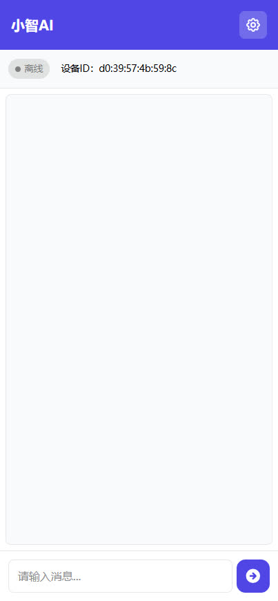
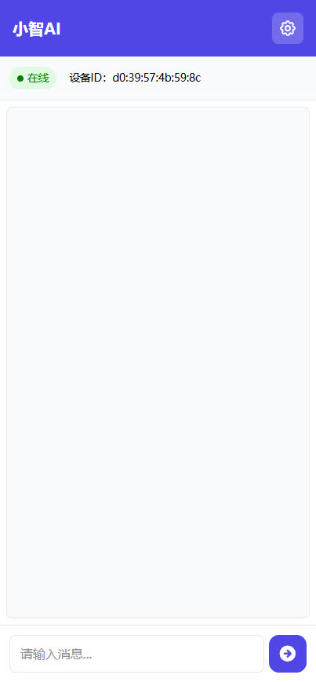
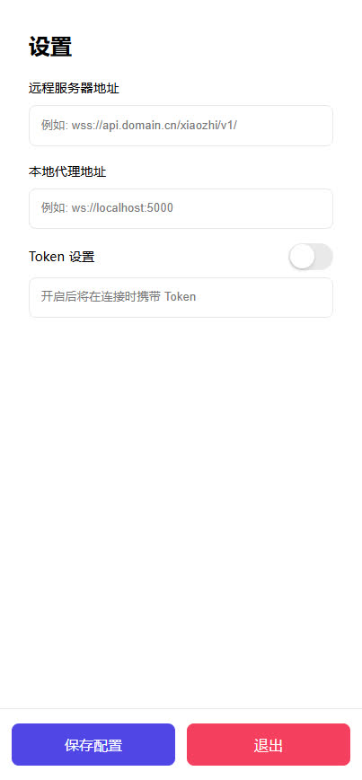

# xiaozhi-webui


## 项目简介
xiaozhi-webui 是一个使用 Python + Vue3 实现的小智语音 Web 端，旨在通过代码学习和在没有硬件条件下体验 AI 小智的对话功能。

本仓库是基于 [xiaozhi-web-client](https://github.com/TOM88812/xiaozhi-web-client) 使用 Vue3 重构的

## 环境要求
- Python 3.12.0
- Windows

## 演示

<div style="display: flex; justify-content: space-around; margin-bottom: 20px;">
    
    
</div>

<div style="display: flex; justify-content: space-around;">
    
    
</div>


## 功能特点

- **文字交互**：支持语音输入与识别，实现智能人机交互。  

## 状态流转图

```
                    +---------------+
                    |               |
                    v               |
    文本消息       +------------+    |   +-------------------+
  +-------------> | CONNECTING | ---+-> |  Websocket Server |
  |               +------------+        +-------------------+
  |                                               |
  |                                               | 文本信息+音频信息
  |                                               |
  |            +------------+                     |
  +----------- |  SPEAKING  | <-------------------+
    完成播放    +------------+
```

## 项目结构

```
├── backend                       # 后端代码
│   ├── libs                       
│   │   └── windows/opus.dll      # Windows 系统需要的音频编解码依赖库
│   ├── .env.example              # 环境变量配置示例文件
│   ├── app.py                    # 程序入口
│   ├── system_info.py            # Windows 处理 opus.dll 加载失败的函数
│   ├── websocket_proxy.py        # WebSocket 代理
│   └── requirements.txt          # 依赖库列表
├── frontend/xiaozhi-webui        # 前端代码
│   ├── public                       
│   │   └──  favicon.ico          # 网站图标
│   ├── src                  
│   |   ├── assets                # 静态资源，全局样式文件等
│   |   ├── stores                # Pinia 状态管理
│   |   ├── App.vue               # 根组件
│   |   └── main.ts               # 入口文件
│   ├── package.json              # 项目依赖配置
│   ├── tsconfig.json             # TypeScript 配置文件
│   ├── vite.config.ts            # Vite 配置文件
│   └── index.html                # 入口 HTML 文件
├── .gitignore                    # Git 忽略文件
├── LICENSE                       # 许可证文件
└── README.md                     # 项目说明文件
```

## 已实现功能

- **文字聊天模式**，像微信好友一样聊天  
- **自动获取 MAC 地址**，避免 MAC 地址冲突

## 待实现功能

- **语音对话**，和小智打电话
- **设置页面**，将用户的配置保存至后端

## 贡献

欢迎提交 Issues 和 Pull Requests！

## 感谢以下开源人员-排名不分前后
[Huang-junsen](https://github.com/Huang-junsen)

[TOM88812](https://github.com/TOM88812)