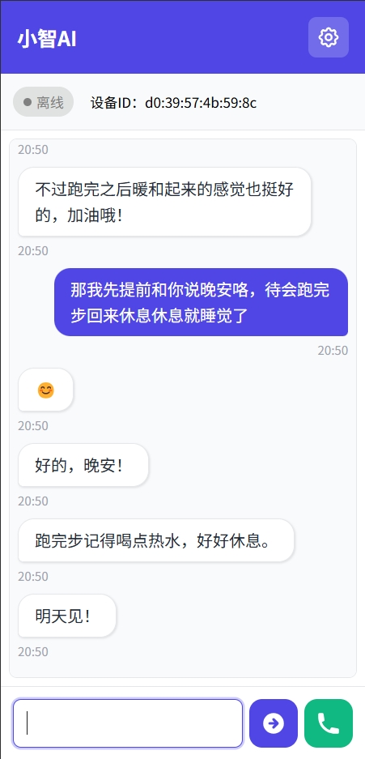
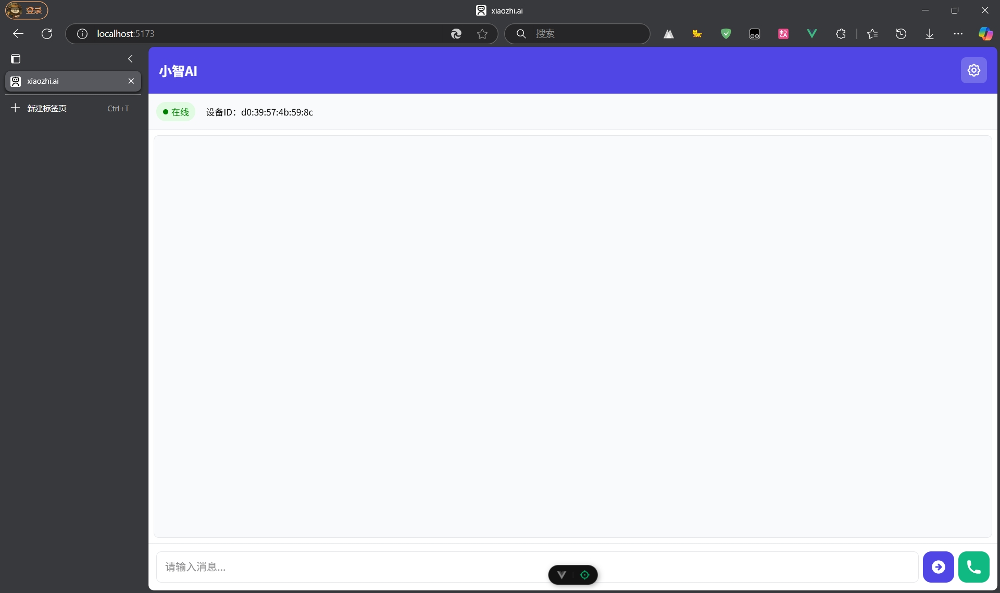

# xiaozhi-webui

## 项目简介

xiaozhi-webui 是一个使用 Python + Vue3 实现的小智语音 Web 端，旨在通过代码学习和在没有硬件条件下体验 AI 小智的对话功能。

本仓库使用 Vue3 对 [xiaozhi-web-client](https://github.com/TOM88812/xiaozhi-web-client) 进行重构，并在此基础上优化和拓展。

小智美美滴头像取自 [小红书 @涂丫丫](http://xhslink.com/a/ZWjAcoOzvzq9)

## 功能特点

- **文字聊天模式**：像微信好友一样聊天
- **语音对话**：和小智语音进行聊天
- **设置页面**：将用户的配置保存至后端
- **自动获取 MAC 地址**：避免 MAC 地址冲突
- **反馈动画**：（语音对话时）用户的讲话波形 + 小智的回答涟漪动画
- **自动生成配置文件**：避免繁杂的配置流程

## 项目展示

<div style="display: flex; justify-content: space-around; margin-bottom: 20px;">
    
    
</div>

<div style="display: flex; justify-content: space-around;">
    
    
</div>

## 环境要求

- Python 3.12.0
- Windows

## 快速开始

### 前端

1. 进入项目目录

```bash
cd frontend/xiaozhi-webui
```

2. 安装依赖

```bash
npm install
```

3. 配置环境变量

```bash
cp .env.example .env
```

4. 启动项目

```bash
npm run dev
```

### 后端

1. 进入项目目录

```bash
cd backend
```

2. 安装依赖

```bash
pip install -r requirements.txt
```

3. 启动项目

```bash
python app.py
```

### 浏览页面

在自己电脑的浏览器中输入 `localhost:5173` 即可访问



## 状态流转图

```
                        reconnect
                    +---------------+
                    |               |
                    v               |
    Text message  +------------+    |     +-------------------+            +-------------------+
    +-----------> | CONNECTING | ---+---> |                   | ---------> |                   |
    |             +------------+          |     Websocket     |            |      Xiaozhi      |
    |             +------------+          |       Proxy       |            |       Server      |
    +------------ |  SPEAKING  | <------- |                   | <--------- |                   |
    speak complet +------------+          +-------------------+            +-------------------+

```

## 项目结构

```
├── backend                             # 后端代码
│   ├── libs
│   │   └── windows/opus.dll            # Windows 系统需要的音频编解码依赖库
│   ├── .env.example                    # 环境变量配置示例文件
│   ├── app.py                          # 程序入口
│   ├── system_info.py                  # Windows 处理 opus.dll 加载失败的函数
│   ├── websocket_proxy.py              # WebSocket 代理
│   └── requirements.txt                # 依赖库列表
├── frontend/xiaozhi-webui              # 前端代码
│   ├── public
│   │   └──  favicon.ico                # 网站图标
│   ├── utils                           # 函数工具
│   │   └──  audio/audioProcessor.ts    # 自定义音频节点的处理类
│   ├── src                             # 源代码
│   |   ├── assets                      # 静态资源，全局样式文件等
│   |   ├── stores                      # Pinia 状态管理
│   |   ├── App.vue                     # 根组件
│   |   └── main.ts                     # 入口文件
│   ├── package.json                    # 项目依赖配置
│   ├── tsconfig.json                   # TypeScript 配置文件
│   ├── vite.config.ts                  # Vite 配置文件
│   └── index.html                      # 入口 HTML 文件
├── .gitignore                          # Git 忽略文件
├── LICENSE                             # 许可证文件
└── README.md                           # 项目说明文件
```

## 贡献

欢迎提交 Issues 和 Pull Requests！

## 感谢以下开源/分享人员-排名不分前后

[Huang-junsen](https://github.com/Huang-junsen)

[TOM88812](https://github.com/TOM88812)

[小红书 @涂丫丫](http://xhslink.com/a/ZWjAcoOzvzq9)

## Star History

[](https://www.star-history.com/#yang-zhihang/xiaozhi-webui&Date)